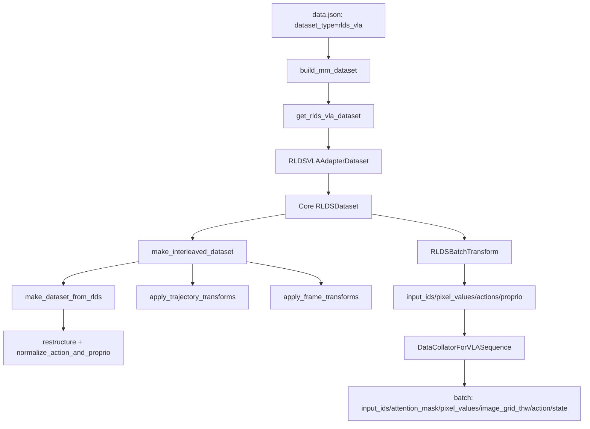

# RLDS VLA 数据处理改造记录

本文档记录将 unifolm-vla 项目中的 RLDS 数据处理能力内置到 MindSpeed-MM 的改造逻辑、涉及文件、配置方法与本地验证方法，便于后续继续扩展模型结构、loss 与训练 loop。

## 1. 改造目标

- 让 MindSpeed-MM 独立支持 RLDS(TFDS) 数据读取与混合采样，不再依赖外部仓库路径注入。
- 在不改动训练主循环的前提下，先打通数据侧能力：`RLDS -> batch`。
- 提供可扩展结构，方便后续接入其他损失函数，如VLA 专用 loss（action loss）。


## 2. 关键设计说明

### 2.1 拆成“RLDS 核心栈 + 适配层 + Collator”

- `rlds_dataloader` 专注“读什么、怎么采样、怎么标准化”
- `rlds_vla_dataset.py` 专注“对接当前模型训练输入结构”
- `DataCollatorForVLASequence` 专注“批处理拼接规则”

这三层解耦后，后续扩展方式更清晰：

- 增加新模型时：新增一个 `batch_transform_builder`
- 增加新 loss 时：在模型/训练步骤读取现有 batch 字段即可
- 不需要反复改 RLDS 主链路

### 2.2 当前 batch 的标准字段

常见输出字段如下：

- `input_ids`
- `attention_mask`
- `pixel_values`
- `image_grid_thw`
- `action`
- `state`

后续模型与 loss 推荐优先依赖这些标准字段，避免耦合到底层 RLDS 原始字段名。

- `DataCollatorForVLASequence` 兼容输入别名：
  - `action` 不存在时会回退读取 `actions`
  - `state` 不存在时会回退读取 `proprio`
- `state` 允许为 `None`（例如关闭 proprio 时）


## 3. 改动总览

### 3.1 内置 RLDS 数据栈

- 新增目录 `mindspeed_mm/data/rlds_dataloader/`
  - 内置 RLDS/TFDS 数据处理主链路（从 unifolm-vla 迁入并改为内部依赖）
  - 该目录包含 RLDS 读取、标准化、混合采样、轨迹/帧变换、归一化相关代码。

### 3.2 数据集新增 RLDS 类型

- 文件：`mindspeed_mm/data/__init__.py`
- 新增分支：
  - `dataset_type == "rlds_vla"` -> `get_rlds_vla_dataset(...)`

### 3.3 新增 RLDS 适配数据集入口

- 文件：`mindspeed_mm/data/datasets/rlds_vla_dataset.py`
- 作用：
  - 读取 `basic_parameters` 与 `preprocess_parameters`
  - 加载 `AutoProcessor`
  - 调用内置 `CoreRLDSDataset/CoreRLDSBatchTransform`
  - 输出样本字段统一到训练侧更友好的命名：
    - `actions -> action`
    - `proprio -> state`
- 可扩展点：
  - 增加了 `batch_transform_type` 注册机制：
    - `register_batch_transform_builder`
    - `build_batch_transform`
  - 默认注册：`qwen2vl`
- 新增行为：
  - 支持环境变量覆盖数据源：
    - `VLA_DATA_ROOT_DIR` 或 `OXE_DATA_ROOT` 覆盖 `basic_parameters.data_root_dir`
    - `VLA_DATA_MIX` 或 `DATA_MIX` 覆盖 `basic_parameters.data_mix`
  - 在懒加载 RLDS 核心类前会做 TensorFlow 运行时校验（要求 `tensorflow` 模块存在且包含 `tf.image`）

### 3.4 新增通用 VLA Collator

- 文件：`mindspeed_mm/data/dataloader/data_collator.py`
- 新增类：
  - `DataCollatorForVLASequence`
  - `DataCollatorForQwen2vlVLA`（兼容别名）
- 新增注册：
  - `DATA_COLLATOR["vla_seq"] = DataCollatorForVLASequence`
  - 保留 `qwen2vl_vla`
- 说明：
  - 当前 `DataCollatorForQwen2vlVLA` 继承 `DataCollatorForVLASequence` 且不改行为，二者逻辑等价
  - `qwen2vl_vla` 是兼容旧配置的别名；`vla_seq` 是推荐的新通用命名
  - 正式训练建议优先使用 `collate_param.model_name: "vla_seq"`
- 作用：
  - pad `input_ids`
  - 生成 `attention_mask`
  - 拼接 `pixel_values`、`image_grid_thw`
  - stack `action`、`state`
- 新增行为：
  - 支持 `fixed_seq_length`：当配置或全局参数存在 `seq_length` 时，会对 `input_ids` 做截断/右侧补齐到固定长度


### 3.5 新增 RLDS 运行依赖

- 文件：`pyproject.toml`
- 新增依赖：
  - `tensorflow`
  - `tensorflow-datasets`
  - `dlimp`


## 4. 端到端数据流（从配置到 batch）

### 4.1 调用链总览



### 4.2 关键入口代码

1) 数据分发到 RLDS 分支  
`mindspeed_mm/data/__init__.py`

```python
elif dataset_type == "rlds_vla":
    return get_rlds_vla_dataset(basic_param, preprocess_param, dataset_param)
```

2) RLDS 适配入口  
`mindspeed_mm/data/datasets/rlds_vla_dataset.py`

```python
def get_rlds_vla_dataset(basic_param, preprocess_param, dataset_param):
    ...
    return RLDSVLAAdapterDataset(basic_param, preprocess_param, **dataset_param)
```
说明：上面是训练主流程会走的入口；`_build_debug_dataloader()` 里也会构造 `RLDSVLAAdapterDataset`，但那只是调试脚本复用同一数据类，不是训练入口。

3) 适配层里调用核心 RLDSDataset  
`mindspeed_mm/data/datasets/rlds_vla_dataset.py`

```python
self.dataset = core_rlds_dataset_cls(
  data_root_dir=data_root_dir,
  data_mix=data_mix,
  batch_transform=batch_transform,
  resize_resolution=resize_resolution,
  shuffle_buffer_size=shuffle_buffer_size,
  train=train,
  image_aug=image_aug,
  window_size=window_size,
  )
```

## 5. RLDS 核心处理步骤与对应代码

下面按“读取 -> 标准化 -> 混采 -> 轨迹变换 -> 帧变换 -> 模型输入”展开。

### 5.1 数据混合规格（mixture）

文件：`mindspeed_mm/data/rlds_dataloader/datasets/rlds/oxe/mixtures.py`

- `OXE_NAMED_MIXTURES` 注册数据混合名与权重  
- 例如
```
"libero_4_task_no_noops": [
  ("libero_spatial_no_noops", 1.0),
  ("libero_object_no_noops", 1.0),
  ("libero_goal_no_noops", 1.0),
  ("libero_10_no_noops", 1.0),
  ]
```

### 5.2 生成每个子数据集的 kwargs + 采样权重

文件：`mindspeed_mm/data/rlds_dataloader/datasets/rlds/oxe/materialize.py`
该文件是在为每个子数据集生成一份可执行的数据契约 （字段映射 + 动作维度规则 + 标准化函数），供后面的 make_dataset_from_rlds 真正落地执行。

关键函数：

`get_oxe_dataset_kwargs_and_weights(...)`
- 根据给定的 Open X-Embodiment 数据集混合配比，生成每个子数据集的配置（kwargs）以及对应的采样权重。
- 返回结果可直接喂给 `make_interleaved_dataset`，用于构建多数据集混合采样器。
```python
def get_oxe_dataset_kwargs_and_weights(
    data_root_dir: Path,
    mixture_spec: List[Tuple[str, float]],
    load_camera_views: Tuple[str] = ("primary",),
    load_depth: bool = False,
    load_proprio: bool = True,
    load_language: bool = True,
    action_proprio_normalization_type: NormalizationType = NormalizationType.NORMAL,
) -> Tuple[Dict[str, Any], List[float]]:
......
    for d_name, d_weight in filtered_mixture_spec:
      try:
          # 逐个数据集生成配置
          kwargs = make_oxe_dataset_kwargs(
              d_name,
              data_root_dir,
              load_camera_views,
              load_depth,
              load_proprio,
              load_language,
              action_proprio_normalization_type,
          )
......
```

`make_oxe_dataset_kwargs(...)`
- 根据指定的 Open-X Embodiment 数据集名称，生成该数据集在训练/推理时所需的完整配置字典（kwargs）。

```python
def make_oxe_dataset_kwargs(
    dataset_name: str,
    data_root_dir: Path,
    load_camera_views: Tuple[str] = ("primary",),
    load_depth: bool = False,
    load_proprio: bool = True,
    load_language: bool = True,
    action_proprio_normalization_type: NormalizationType = NormalizationType.NORMAL,
) -> Dict[str, Any]:
......
```

关键能力：

- 按数据集配置映射 camera/depth/proprio/language 字段
  - 作用：不同 RLDS 子数据集字段名不一样，这里先统一成后续 pipeline 能识别的配置。比如在 make_oxe_dataset_kwargs 中，过滤相机视角 image_obs_keys / depth_obs_keys，根据 load_proprio 去掉 state_obs_keys，根据 load_language 注入 language_key="language_instruction"。

- 根据 action_encoding 设置 `absolute_action_mask` 与 `action_normalization_mask`
  - 作用：告诉后续归一化逻辑“哪些动作维度要归一化、哪些不该归一化”。
  - 例如 EEF_POS ：absolute_action_mask = [False]*6 + [True]，
action_normalization_mask = [True]*6 + [False]，这通常表示前 6 维可归一化，最后 gripper 维按绝对量处理。

- 注入标准化函数 `standardize_fn`
  - 作用：把每个原始数据集“各自字段”转成统一格式（observation/action/task）。后续在 make_dataset_from_rlds 的 restructure(...) 里会真正调用这个 standardize_fn 。

### 5.3 从 TFDS/RLDS 读原始轨迹并重构字段

文件：`mindspeed_mm/data/rlds_dataloader/datasets/rlds/dataset.py`  
函数：`make_dataset_from_rlds(...)`

关键逻辑：

- `builder = tfds.builder(name, data_dir=data_dir, version="1.0.0")` 构建 TFDS Builder
- `restructure(traj)` 把原始字段映射为统一结构：
  - `observation.image_*`
  - `observation.proprio`
  - `task.language_instruction`
  - `action`
  - `dataset_name`
- 训练/验证切分：
  - 无 val 时：`train[:95%]` 与 `train[95%:]`
  - 有 `val`，则用 `train` / `val`
- 归一化：
  - 调用 `normalize_action_and_proprio(...)`
- 组装最终 dataset pipeline  
   最后通过 dlimp 的链式调用把步骤串起来：

```python
dataset = (
    dl.DLataset.from_rlds(
        builder,
        split=split,
        shuffle=shuffle,
        num_parallel_reads=num_parallel_reads,
    )
    .traj_map(restructure, num_parallel_calls)  # 重整字段
    .traj_map(
        partial(
            normalize_action_and_proprio,
            metadata=dataset_statistics,
            normalization_type=action_proprio_normalization_type,
        ),
        num_parallel_calls,
    )
)
```

注意这里仍是“轨迹级结构整理 + 数值归一化”，还没做图像 decode/resize/augment；帧级处理在 `apply_frame_transforms(...)` 阶段执行。

### 5.4 归一化策略

文件：`mindspeed_mm/data/rlds_dataloader/datasets/rlds/utils/data_utils.py`  
函数：`normalize_action_and_proprio(...)`

支持三种策略：

- `NORMAL`：标准分数 `(x-mean)/std`
- `BOUNDS`：`[min,max] -> [-1,1]`
- `BOUNDS_Q99`：`[q01,q99] -> [-1,1]` 并裁剪

### 5.5 多数据集混合采样

文件：`mindspeed_mm/data/rlds_dataloader/datasets/rlds/dataset.py`  
函数：`make_interleaved_dataset(...)`，将多个数据集按权重混合成一个可迭代的数据集
关键步骤：

1. 权重准备 ：没给 sample_weights 就默认全 1，并做归一化（可选按数据集大小平衡）。
2. 子集构建 ：每个子数据集先 make_dataset_from_rlds ，再 repeat + trajectory transforms + flatten 变成可持续采样流。
3. 按权重混采 ：用 dl.DLataset.sample_from_datasets(datasets, sample_weights) 进行跨数据集采样。
4. 混采后统一处理 ： shuffle -> frame transforms -> (optional) batch ，最后输出训练可用数据流。

### 5.6 轨迹级变换

文件：`mindspeed_mm/data/rlds_dataloader/datasets/rlds/dataset.py`  
函数：`apply_trajectory_transforms(...)`

关键功能：

- 过滤无语言样本（`skip_unlabeled`）
- 动作/本体异常过滤（`max_action` / `max_proprio`）
- `traj_transforms.chunk_act_obs(...)` 滑窗切块
  - `window_size`
  - `future_action_window_size = NUM_ACTIONS_CHUNK - 1`

### 5.7 帧级变换

文件：`mindspeed_mm/data/rlds_dataloader/datasets/rlds/dataset.py`  
函数：`apply_frame_transforms(...)`
对“帧级别”的数据做通用变换，通常是 CPU 密集操作：解码、resize、数据增强等。
输入已经是“chunk”后的数据：每条样本的 observation 里每个字段都是 [T, ...] 的时序张量。
关键功能：
1. 统一解码并 resize RGB/深度图 `obs_transforms.decode_and_resize(...)`；
2. 训练模式下再做随机数据增强 `obs_transforms.augment(...)`；
3. 所有操作通过 frame_map 并行执行，支持逐帧加速。


## 6. 适配层与 Collator（MindSpeed-MM 对接点）

### 6.1 RLDSVLAAdapterDataset

文件：`mindspeed_mm/data/datasets/rlds_vla_dataset.py`

功能：

- 从 `preprocess_parameters.model_name_or_path` 加载 `AutoProcessor`
- 支持 `batch_transform_type` 插件注册：
  - `register_batch_transform_builder(...)`
  - `build_batch_transform(...)`
- 迭代时字段名映射：
  - `actions -> action`
  - `proprio -> state`

### 6.2 RLDSBatchTransform（样本级转模型输入）

文件：`mindspeed_mm/data/rlds_dataloader/datasets/datasets.py`

功能：

- 把窗口内图像转成 chat message
- 用 processor 生成：
  - `input_ids`
  - `attention_mask`
  - `pixel_values`
  - `image_grid_thw`
- 输出动作目标：
  - `actions`（后续重命名为 `action`）
  - `proprio`（后续重命名为 `state`）

### 6.3 DataCollatorForVLASequence（batch 级）

文件：`mindspeed_mm/data/dataloader/data_collator.py`

关键逻辑：

- `pad_sequence` 对齐 `input_ids`
- `attention_mask = input_ids.ne(pad_token_id)`
- `pixel_values` / `image_grid_thw` 按 batch 拼接
- `action` / `state` 按 batch 堆叠


## 7. 配置示例

示例（仅示意关键字段）：

```json
{
  "dataset_param": {
    "dataset_type": "rlds_vla",
    "basic_parameters": {
      "data_root_dir": "/data_vol/cyd/dataset/modified_libero_rlds",
      "data_mix": "libero_4_task_no_noops",
      "window_size": 1,
      "shuffle_buffer_size": 10000,
      "resize_resolution": [224, 224],
      "use_wrist_image": true,
      "use_proprio": true,
      "train": true,
      "batch_transform_type": "qwen2vl"
    },
    "preprocess_parameters": {
      "model_name_or_path": "/data_vol/cyd/weights/Qwen2.5-VL-7B-Instruct"
    }
  },
  "dataloader_param": {
    "dataloader_mode": "sampler",
    "collate_param": {
      "model_name": "vla_seq"
    }
  }
}
```

补充说明（与当前实现一致）：
- 训练脚本中如设置了
  - `VLA_DATA_ROOT_DIR` / `OXE_DATA_ROOT`
  - `VLA_DATA_MIX` / `DATA_MIX`
  则会覆盖上面 `data_root_dir` 与 `data_mix` 的 JSON 配置值。

## 8. 本地 RLDS 加载验证方法

### 8.1 环境准备

确保环境已安装以下依赖：

- tensorflow
- tensorflow-datasets
- dlimp
- transformers
- qwen_vl_utils

### 8.2 运行 batch 观测脚本

在 `MindSpeed-MM-master` 根目录执行。  
注意：MindSpeed-MM 的 `mindspeed_mm/__init__.py` 默认会触发 Megatron/MindSpeed patch，做纯数据调试时需要先设置 `NON_MEGATRON=true`，避免进入训练补丁初始化逻辑。

```bash
NON_MEGATRON=true \
python -m mindspeed_mm.data.datasets.rlds_vla_dataset \
  --data_root_dir /data_vol/cyd/dataset/modified_libero_rlds/ \
  --data_mix "libero_4_task_no_noops" \
  --model_name_or_path /data_vol/cyd/weights/Qwen2.5-VL-7B-Instruct \
  --batch_size 2 \
  --num_batches 1 \
  --window_size 1 \
  --use_proprio \
  --use_wrist_image \
  --train
```
### 8.3 成功判定标准

命令输出中应出现 batch 字段摘要，至少包含：

- `input_ids`（二维）
- `attention_mask`（二维）
- `pixel_values`（视觉张量）
- `action`（动作张量）
- `state`（若启用 proprio）

如果字段存在且形状符合预期，说明“RLDS -> DataLoader -> Collator”链路已打通。

部分输出结果
```
#############################################################
# Loading the following 4 datasets (incl. sampling weight): #
# libero_spatial_no_noops: =========================0.193699#
# libero_object_no_noops: ==========================0.244945#
# libero_goal_no_noops: ============================0.190306#
# libero_10_no_noops: ==============================0.371049#
#############################################################

INFO:root:Threads per Dataset:[1 1 1 1]
INFO:root:Reads per Dataset:[1 1 1 1]
INFO:absl:Load dataset info from /data_vol/cyd/dataset/modified_libero_rlds/libero_spatial_no_noops/1.0.0
INFO:absl:Creating a tf.data.Dataset reading 16 files located in folders:/data_vol/cyd/dataset/modified_libero_rlds/libero_spatial_no_noops/1.0.0.
INFO:absl:Constructing tf.data.Dataset libero_spatial for split train[:95%],from /data_vol/cyd/dataset/modified_libero_rlds/libero_spatial_no_noops/1.0.0
2026-03-24 03:30:07.714201:I tensorflow/core/grappler/optimizers/data/replicate_on_split.cc:32]Running replicate on split optimization
INFO:absl:Load dataset info from /data_vol/cyd/dataset/modified_libero_rlds/libero_object_no_noops/1.0.0
......
INFO:root:Applying frame transforms on dataset..
{'input_ids': {'shape'[2, 168],'dtype': 'torch.int64', 'device':'cpu'}, 'attention_mask': {'shape': [2, 168], 'dtype': 'torch.bool', 'device':'cpu'}, 'pixel_values': {'shape': [512, 1176], 'dtype': 'torch.float32', 'device': 'cpu'}, 'image_grid_thw': {'shape': [2, 3], 'dtype':'torch.int64', 'device': 'cpu'}, 'action':{'shape':[2, 8, 7], 'dtype': 'torch.float32', 'device': 'cpu'}, 'state': {'shape': [2, 1, 8], 'dtype': 'torch.float32', 'device': 'cpu'}}
```
从上面日志可以看出：
- 4 个子数据集都被正确加载并参与混采，权重约为：0.193699 + 0.244945 + 0.190306 + 0.371049 ≈ 1
- TFDS/RLDS 目录读取正常（ Load dataset info 、 Constructing tf.data.Dataset ... train[:95%] ）
- 帧变换阶段正常进入（ Applying frame transforms on dataset ）
- 最终产出了 batch，包含关键字段：input_ids、attention_mask、pixel_values、image_grid_thw、action、state

含义解释：
- `input_ids [B, L] = [2, 168]`
  - B=2 批大小，L=文本 token 长度
- `attention_mask [B, L]`
  - 对应 token 有效位（非 pad）
- `pixel_values [N_img_tokens, vision_hidden_or_patch_dim] = [512, 1176]`
  - 这是 Qwen2.5-VL processor 展平后的视觉输入表示，不是传统 `[B,C,H,W]`
- `image_grid_thw [B, 3]`
  - 每个样本视觉 token 的时间/高/宽网格信息
- `action [B, T_act, D_act] = [2, 8, 7]`
  - `T_act=8` 由动作 chunk 决定（当前配置）
  - `D_act=7` 对应 LIBERO 动作维度
- `state [B, T_obs, D_state] = [2, 1, 8]`
  - `T_obs=1` 与 `window_size=1` 一致
  - `D_state=8` 对应本体状态维度


## 9. 遇到的问题

### 9.1 `ModuleNotFoundError: No module named pkg_resources`

- 旧库依赖 `pkg_resources`，而新 setuptools 移除该模块
- 建议降级：

```bash
pip install "setuptools<82"
```

### 9.2 `ArgumentParser.__init__() got an unexpected keyword argument 'allow_abbrev'`

- 这是 MindSpeed 补丁初始化链路问题，不是 RLDS 逻辑问题
- 纯数据调试时先设置 `NON_MEGATRON=true`

### 9.3 TensorFlow 运行时不完整导致 RLDS 初始化失败

- 现象：`rlds_vla_dataset` 初始化时报 TensorFlow 运行时异常，提示 `has_tf_image=False`
- 原因：环境中存在被裁剪/被同名模块覆盖的 TensorFlow，缺少 `tf.image`
- 解决：
  - 安装完整 TensorFlow 发行版（`tensorflow` 或 `tensorflow-cpu`）
  - 检查工程目录下是否有同名 `tensorflow.py` 造成模块遮蔽


## 10. 后续计划

- 下一阶段接入 action head 与 action loss
- 训练侧新增 VLA 分支，保持现有 VLM 分支不变
