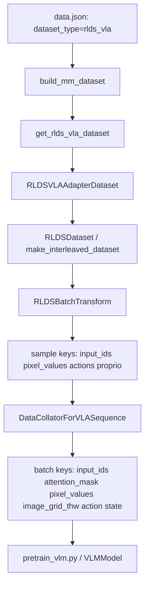

# RLDS VLA Pipeline

本文档聚焦：
- 端到端流程图
- 关键配置速查表

---

## 1. 一图看全流程



---

## 2. 数据链路关键点

| 环节 | 入口文件 | 需要关注什么 |
|---|---|---|
| 数据集分发 | `mindspeed_mm/data/__init__.py` | `dataset_type` 必须是 `rlds_vla` |
| RLDS 适配层 | `mindspeed_mm/data/datasets/rlds_vla_dataset.py` | 会把 `actions->action`、`proprio->state` |
| RLDS 核心流 | `mindspeed_mm/data/rlds_dataloader/datasets/datasets.py` | 混采、轨迹变换、帧变换、归一化 |
| Batch 拼装 | `mindspeed_mm/data/dataloader/data_collator.py` | `vla_seq` / `qwen2vl_vla`，输出训练侧标准字段 |

---

## 3. 配置速查表

### 3.1 `data.json`

| 配置路径 | 必填 | 说明 | 常用值 |
|---|---|---|---|
| `dataset_param.dataset_type` | 是 | 启用 RLDS VLA 分支 | `rlds_vla` |
| `dataset_param.basic_parameters.data_root_dir` | 是 | RLDS TFDS 根目录 | `/data_vol/.../modified_libero_rlds` |
| `dataset_param.basic_parameters.data_mix` | 是 | 混采名称 | `libero_4_task_no_noops` |
| `dataset_param.basic_parameters.window_size` | 建议 | 轨迹窗口长度 | `1` |
| `dataset_param.basic_parameters.shuffle_buffer_size` | 建议 | 混洗缓冲区 | `10000`~`256000` |
| `dataset_param.basic_parameters.resize_resolution` | 建议 | 图像分辨率 | `[224,224]` |
| `dataset_param.basic_parameters.use_wrist_image` | 可选 | 是否启用腕部相机 | `true/false` |
| `dataset_param.basic_parameters.use_proprio` | 可选 | 是否输出 state | `true/false` |
| `dataset_param.preprocess_parameters.model_name_or_path` | 是 | Qwen2.5-VL processor 路径 | `/data_vol/.../Qwen2.5-VL-7B-Instruct` |

### 3.2 `dataloader_param`

| 配置路径 | 推荐值 | 说明 |
|---|---|---|
| `dataloader_param.collate_param.model_name` | `vla_seq` | 新通用命名 |

说明：
- `qwen2vl_vla` 仍可用，但等价于 `vla_seq`。

### 3.3 环境变量覆盖优先级

以下变量存在时，会覆盖 `data.json` 中同名配置：

| 环境变量 | 覆盖项 |
|---|---|
| `VLA_DATA_ROOT_DIR` 或 `OXE_DATA_ROOT` | `basic_parameters.data_root_dir` |
| `VLA_DATA_MIX` 或 `DATA_MIX` | `basic_parameters.data_mix` |

---

## 4. 训练侧 batch 契约

训练主流程最终期望以下字段：

| 字段 | 典型形状 | 说明 |
|---|---|---|
| `input_ids` | `[B, L]` | 文本 token |
| `attention_mask` | `[B, L]` | token mask |
| `pixel_values` | processor 决定 | 视觉输入 |
| `image_grid_thw` | `[N, 3]` 或 `[B, 3]` | 视觉网格信息 |
| `action` | `[B, T_act, D_act]` | 动作监督 |
| `state` | `[B, T_obs, D_state]` 或 `None` | 本体状态 |

兼容行为（collator 内置）：
- 若样本没有 `action`，会回退读取 `actions`
- 若样本没有 `state`，会回退读取 `proprio`
- 可按 `seq_length` 对 `input_ids` 固定长度截断/补齐

---

## 5. 最小可用配置模板

```json
{
  "dataset_param": {
    "dataset_type": "rlds_vla",
    "preprocess_parameters": {
      "model_name_or_path": "/data_vol/cyd/weights/Qwen2.5-VL-7B-Instruct"
    },
    "basic_parameters": {
      "data_root_dir": "/data_vol/cyd/dataset/modified_libero_rlds",
      "data_mix": "libero_4_task_no_noops",
      "window_size": 1,
      "shuffle_buffer_size": 128,
      "resize_resolution": [224, 224],
      "use_wrist_image": true,
      "use_proprio": true,
      "train": true,
      "image_aug": false,
      "batch_transform_type": "qwen2vl",
      "val_rate": 0.02
    }
  },
  "dataloader_param": {
    "dataloader_mode": "base",
    "drop_last": true,
    "collate_param": {
      "model_name": "vla_seq"
    },
    "pin_memory": true,
    "shuffle": false
  }
}
```

---

## 6. 维护建议

- 新增模型适配时，优先扩展 `batch_transform_type`，避免改 RLDS 主链路。
- 配置变更优先改 `data.json`，环境变量仅用于实验覆盖。