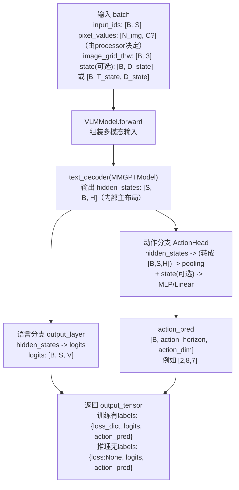
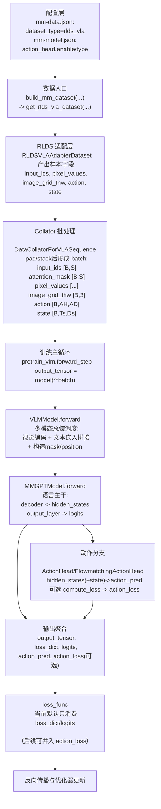
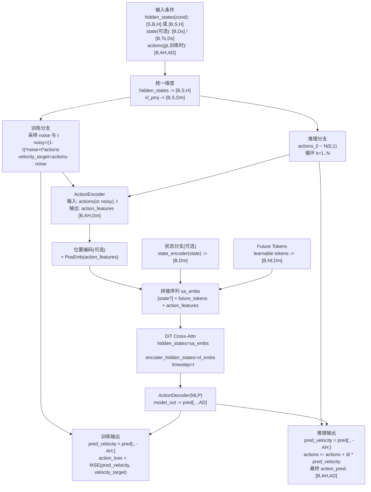

# Action Head 接入改造记录（不含 Action Loss）

本文档记录在 MindSpeed-MM 中完成的 action head 接入改造，目标是打通 `forward -> action_pred`，并保持现有 LM loss 训练链路不变。

文档重点说明：

- 改了哪些代码
- 为什么这样改
- 实际调用链如何流转
- 当前能力边界与后续建议

## 1. 改造目标

- 在已有 RLDS VLA 数据链路基础上，把 `action/state` 对应的预测头接到模型中。
- 在不引入 action loss 的前提下，先输出动作预测张量 `action_pred`。
- 兼容 Megatron PP/TP/CP 训练范式，尽量避免影响既有 VLM 训练逻辑。

## 2. 关键设计说明

### 2.1 设计原则

1. **最小侵入**：不改 `pretrain_vlm.py` 的 loss 计算主逻辑，仅在输出中补充 `action_pred`。  
2. **配置驱动**：通过 `mm-model.json` 的 `action_head` 段控制行为。  
3. **并行友好**：只在 `post_process=True` 的最后 text stage 持有并执行 action head，避免 PP 重复构建。  
4. **向后兼容**：`action_head.enable=false` 时，行为应等价于原始 VLM。

### 2.2 输出形态约定

当前 VLM 前向返回结构新增字段：

- `logits`：语言模型输出（原有）
- `loss_dict` 或 `loss`：原有训练路径所需（原有）
- `action_pred`：动作预测，形状约为 `[B, action_horizon, action_dim]`（新增）

## 3. 改动总览

### 3.1 新增 Action 模块目录

- 新增：`mindspeed_mm/models/action/action_head.py`
- 新增：`mindspeed_mm/models/action/__init__.py`

核心接口：

```python
def forward(self, hidden_states: torch.Tensor, state: Optional[torch.Tensor] = None) -> torch.Tensor:
    """
    前向传播逻辑
    -参数
    hidden_states : 主干网络输出的序列特征，通常为 (B,S,H) 或 (S,B,H)
    state : 可选的额外状态向量，若提供则与文本特征融合 , shape 为 (B,state_dim) 或 (B,T,state_dim)
    -返回
    预测的动作序列, shape 为 (B, action_horizon, action_dim)
    """
    # 1. 统一维度顺序 -> (B,S,H)
    hidden_states = self._to_batch_first(hidden_states)

    # 2. 池化：取序列最后一个时刻或全局平均
    if self.pooling == "mean":
        pooled = hidden_states.mean(dim=1)  # (B,H)
    else:
        pooled = hidden_states[:, -1, :]      # (B,H)

    # 3. 输入维度映射
    pooled = self.input_proj(pooled)        # (B,hidden_size)

    # 4. 融合额外状态（若提供）
    if state is not None and self.state_proj is not None:
        if state.ndim == 3:                 # (B,T,state_dim) -> 取最后一帧
            state = state[:, -1, :]
        state = state.to(device=pooled.device, dtype=pooled.dtype)
        pooled = pooled + self.state_proj(state)  # 残差式融合

    # 5. 正则化
    pooled = self.dropout(pooled)

    # 6. 输出映射并 reshape 成动作序列
    action_pred = self.output_proj(pooled)  # (B, action_horizon * action_dim)
    batch_size = action_pred.shape[0]
    return action_pred.view(batch_size, self.action_horizon, self.action_dim)
```

设计要点：

- 支持 `hidden_layout`（`sbh`/`bsh`）和 `pooling`（`last`/`mean`）。
- 支持可选 `state` 融合（`state_dim > 0` 时启用 `state_proj`）。
- 输出层直接映射到 `action_horizon * action_dim`，最终 reshape 成 `[B, H, D]`。

### 3.2 扩展 MMGPTModel 输出能力（logits + hidden_states）

文件：`mindspeed_mm/models/common/mm_gpt_model.py`

改动点：

- `forward` 增加参数：`output_hidden_states: bool = False`
- 当 `labels is None` 且 `output_hidden_states=True` 时，返回：
  - `{"logits": logits, "hidden_states": hidden_states}`

目的：

- 复用同一条 decoder 前向，不新增第二次 decoder 计算。
- 为 action head 提供需要的 hidden states，同时保留 logits 产出能力。

### 3.3 在 VLMModel 中接入 action head 构建与推理

文件：`mindspeed_mm/models/vlm_model.py`

改动点：

1. 在 `__init__` 中读取 `config.action_head` 并生成开关：
   - `self.action_head_config`
   - `self.enable_action_head`
2. 新增 `self.action_head` 成员和 `_build_action_head(...)` 构建函数。
3. 在 text decoder 前向时，传入 `output_hidden_states=self.enable_action_head`。
4. 在 `post_process` 分支中：
   - 解析 `hidden_states`
   - 调用 `self.action_head(hidden_states, state=...)`
   - 将 `action_pred` 合并进返回字典。

### 3.4 训练入口兼容性结论

文件：`pretrain_vlm.py`

当前 `loss_func` 仅依赖：

- `output_tensor["loss_dict"]`
- `output_tensor["logits"]`（`log_tps` 场景）

因此 `output_tensor` 增加 `action_pred` 不会破坏现有 loss 路径，无需改训练主循环。

## 4. 端到端调用链（配置到 action_pred）

### 4.1 调用链总览

```mermaid
graph TD
  A[mm-model.json: action_head.enable=true] --> B[VLMModel.__init__ 读取 config.action_head]
  B --> C[仅 post_process stage 构建 ActionHead]
  C --> D[VLMModel.forward 调用 text_decoder]
  D --> E[MMGPTModel.forward output_hidden_states=true]
  E --> F[返回 logits + hidden_states]
  F --> G[ActionHead.forward(hidden_states, state)]
  G --> H[action_pred: B x action_horizon x action_dim]
  H --> I[output_tensor: loss_dict/logits/action_pred]
  I --> J[pretrain_vlm.py loss_func 继续只消费 loss_dict/logits]
```

### 4.2 关键代码锚点

- ActionHead 实现：`mindspeed_mm/models/action/action_head.py`
- MMGPTModel 双输出分支：`mindspeed_mm/models/common/mm_gpt_model.py`
- VLMModel 接入与返回 `action_pred`：`mindspeed_mm/models/vlm_model.py`
- 训练 loss 消费逻辑：`pretrain_vlm.py`

### 4.3 单页流程图（从 input_ids/pixel 到 logits 和 action_pred）



图后速记：

- `hidden_states` 是 text decoder 的中间语义特征，不是词表概率。
- `logits` 是语言建模分支输出；`action_pred` 是动作预测分支输出。
- `action_pred` 的形状语义固定为 `[B, action_horizon, action_dim]`。

概念解释：

- `action_head`：动作预测分支的最后预测头。它消费 hidden states（可选融合 state），输出未来动作序列。
- `hidden_states`：text decoder 处理图文输入后的“理解结果向量”，每个 token 位置对应一个向量表示。
- `action_horizon`：一次前向预测未来多少步动作（时间长度）。
- `action_dim`：每一步动作向量的维度（例如 7 维：位置/姿态/夹爪）。

## 5. 代码级说明

### 5.1 为什么在 MMGPTModel 增加 `output_hidden_states` 参数

如果只让 VLMModel 获得 logits，action head 还需要 hidden states，就会出现两种代价高方案：

- 重复跑一次 decoder
- 改更多底层接口并影响已有调用

本次采用显式开关的方式，只在需要 action head 时拿 hidden states，默认保持旧行为，风险更低。

### 5.2 为什么 action head 只在 `post_process=True` 持有

MindSpeed-MM 的 PP 场景下，每个 stage 只持有局部子模块。  
将 action head 放在最后 stage 有两个好处：

- 避免每个 stage 重复创建 action head 参数
- 输入 hidden states 与 logits 同源，更容易保证形状一致性

### 5.3 为什么训练入口不改 loss

本阶段目标是先打通预测链路，不引入 action loss。  
将 action_pred 透传出来后，后续同事可直接在 `forward_step/loss_func` 或新任务入口中增量接入损失，不需要回改模型结构。

## 6. 配置示例（建议）

以下是建议加到 `mm-model.json` 顶层的配置段：

```json
{
  "action_head": {
    "enable": true,
    "action_dim": 7,
    "action_horizon": 8,
    "state_dim": 8,
    "hidden_size": 4096,
    "hidden_layout": "sbh",
    "pooling": "last",
    "dropout": 0.0
  }
}
```

说明：

- `action_horizon` 与 RLDS action chunk 长度建议保持一致。
- `state_dim` 需与数据侧 `state` 维度一致；若不使用 `state` 可设为 `0`。
- 若配置了 `num_queries` 但未配置 `action_horizon`，实现中会回退使用 `num_queries`。

## 7. 与 RLDS VLA 数据链路的衔接

`rlds_vla_pipeline_migration.md` 中 batch 已提供标准字段：

- `action`
- `state`

本次模型改造已支持从 `kwargs["state"]` 或 `kwargs["action_state"]` 读取状态向量。  
因此从数据到模型的推荐链路是：

1. RLDS adapter/collator 输出 `state`
2. `model(**batch)` 前向携带 `state`
3. `action_head` 融合 hidden state + state，输出 `action_pred`

## 8. 改造前后返回结构对照表（字段 / shape / 阶段）

说明：

- 表中 `S` 表示序列长度，`V` 表示词表大小，`H` 表示 hidden_size，`B` 表示 batch size。
- `AH` 表示 `action_horizon`，`AD` 表示 `action_dim`。
- 由于 PP/CP 等并行策略存在，部分张量在中间阶段可能是分片态，表格给出的是逻辑形态。

| 阶段 | 改造前返回 | 改造后返回 | 关键 shape（逻辑） | 备注 |
|---|---|---|---|---|
| `MMGPTModel.forward`（`labels is None`, `output_hidden_states=False`） | `logits` | `logits` | `logits: [B, S, V]` | 默认行为不变 |
| `MMGPTModel.forward`（`labels is None`, `output_hidden_states=True`） | 不支持该模式 | `{"logits","hidden_states"}` | `logits: [B, S, V]`，`hidden_states: [S, B, H]`（sbh） | 为 action head 提供特征 |
| `VLMModel.forward`（`post_process=True`, 无 labels, `action_head.enable=false`） | `{"loss": None, "logits": ...}` | `{"loss": None, "logits": ..., "action_pred": None}` | `logits: [B, S, V]` | 向后兼容，`action_pred` 为空 |
| `VLMModel.forward`（`post_process=True`, 无 labels, `action_head.enable=true`） | 不支持 action 输出 | `{"loss": None, "logits": ..., "action_pred": ...}` | `action_pred: [B, AH, AD]` | 新增动作预测 |
| `VLMModel.forward`（`post_process=True`, 有 labels） | `{"loss_dict","logits"}` | `{"loss_dict","logits","action_pred"}` | `loss_dict["loss"]` 标量；`action_pred: [B, AH, AD]` 或 `None` | 现有 LM loss 路径保持不变 |
| `pretrain_vlm.py -> loss_func` 消费字段 | `loss_dict/logits` | `loss_dict/logits` | 与改造前一致 | `action_pred` 仅透传，不参与 loss |

补充：

- `ActionHead` 输入 hidden states 默认按 `sbh` 处理；若配置 `hidden_layout="bsh"`，则按 `[B, S, H]` 解释。
- `ActionHead` 输出 shape 固定为 `[B, action_horizon, action_dim]`。

## 9. 异常排查清单（常见 shape mismatch 场景）

### 9.1 `RuntimeError: mat1 and mat2 shapes cannot be multiplied`

常见原因：

- `config.action_head.hidden_size` 与 `text_hidden_size` 配置不一致，且自定义改动里删除了 `input_proj`。
- `state_dim` 与 batch 中 `state` 最后一维不一致。

排查建议：

1. 检查 `mm-model.json`：`action_head.hidden_size/action_dim/action_horizon/state_dim` 是否与数据和模型一致。  
2. 打印关键 shape：`hidden_states.shape`、`state.shape`、`action_pred.shape`。  
3. 确认是否使用了最新 `ActionHead` 实现中的 `input_proj/state_proj`。

### 9.2 `ValueError: Expected hidden_states as 3D tensor`

常见原因：

- 上游传入了 2D 或 4D 张量（例如错误地做了 flatten 或额外 unsqueeze）。

排查建议：

1. 在 `VLMModel.forward` 中确认从 decoder 拿到的 `hidden_states` 为三维。  
2. 检查是否在中间 hook/patch 中改动了 decoder 返回格式。  
3. 若自定义了 action 分支，保持输入协议为 `[S,B,H]` 或 `[B,S,H]`。

### 9.3 `action_pred` shape 与预期不符（如 `[B,1,AD]`）

常见原因：

- `action_horizon` 未配置，回退到了 `num_queries` 默认值（可能为 1）。

排查建议：

1. 显式配置 `action_head.action_horizon`。  
2. 检查是否误以为 `window_size` 会自动映射为 `action_horizon`。  
3. 用单 batch 验证 `action_pred.shape == [B, AH, AD]`。

### 9.4 `state` 相关 shape 错误（如 `[B,T,D]` vs `[B,D]`）

常见原因：

- 数据侧输出 `state` 为 `[B,T,D]`，而定制分支按 `[B,D]` 使用。

排查建议：

1. 当前实现默认对 3D state 取最后一帧：`state[:, -1, :]`。  
2. 若任务需要融合整段 state 序列，请在 action head 内部定义时序聚合策略。  
3. 保证 `state_dim == state.shape[-1]`。

### 9.5 并行场景下最后阶段拿不到 `action_pred`

常见原因：

- action head 只在 `post_process=True` 阶段执行，非最后 stage 自然不会产出。

排查建议：

1. 确认日志中的 pipeline stage 与 `post_process` 标志。  
2. 仅在最后 stage 检查 `output_tensor["action_pred"]`。  
3. 避免在中间 stage 强行访问 action 输出。

### 9.6 `loss_func` 报错找不到键（误改返回结构）

常见原因：

- 自定义改造时覆盖了 `loss_dict/logits` 键名，或返回类型不是 dict。

排查建议：

1. 保持返回结构至少包含 `loss_dict` 与 `logits`（有 labels 场景）。  
2. `action_pred` 作为附加键，不替代原键。  
3. 先对齐基线实现，再叠加新字段。

## 10. 本地验证记录

已完成的校验：

- Python 语法编译通过：

```bash
python -m compileall \
  mindspeed_mm/models/action/action_head.py \
  mindspeed_mm/models/common/mm_gpt_model.py \
  mindspeed_mm/models/vlm_model.py
```

说明：

- 运行时 smoke test 依赖 `torch` 环境；若当前终端环境缺失 torch，只能完成语法级验证。

## 11. 已知边界与注意事项

### 11.1 当前还没有 action loss

这是阶段性设计，不是遗漏。`action_pred` 已透传，后续可独立接 loss。

### 11.2 现有 UnifoLM-VLA checkpoint 不能直接无改造继续训

原因仍然成立：

- checkpoint 形态与 Megatron 不同
- 需要做参数名映射（至少 action head 子模块）

### 11.3 并行形状约束需继续验证

尤其在复杂 PP/TP/CP 组合下，建议补充：

- hidden states 形状一致性检查
- action_pred 统计日志（norm/range）与 NaN 监控

## 12. 下一步建议

1. 增加 `pretrain_vla.py` 或 `--mm-task vla` 任务分支，避免与纯 VLM 入口强耦合。  
2. 补齐 checkpoint 导入脚本：`pytorch_model.pt` 中 `action_model.*` 到 MindSpeed-MM key 的映射。  
3. 接入 action loss，并支持 action head 独立学习率与冻结策略。  
4. 增加 `predict_action` 推理/评估接口与 dataset statistics 显式加载能力。  

## 13. Phase-2 迁移进展（FlowmatchingActionHead）

已在当前 Phase-1 基础上完成 FlowmatchingActionHead 的可用接入，保持 `action_pred` 作为统一对外键名。

### 13.1 新增代码

- `mindspeed_mm/models/action/flowmatching_action_head.py`
  - 新增 `FlowmatchingActionHead`，支持：
    - `forward(hidden_states, state)` -> `action_pred`
    - `predict_action(hidden_states, state)` -> 迭代去噪动作序列
    - `compute_loss(hidden_states, actions, state, repeated_diffusion_steps)` -> flow-matching MSE
- `mindspeed_mm/models/action/flow_matching_modules/`
  - `action_encoder.py`
  - `cross_attention_dit.py`
  - `__init__.py`

### 13.2 现有模型接入方式

`VLMModel` 中 action head 构建逻辑已改为类型分派：

- `action_head.type` 为 `flowmatching/flow_matching/flowmatching_dit/dit/dit_l` 时：
  - 构建 `FlowmatchingActionHead`
- 其他类型：
  - 保持使用当前 `ActionHead`（MLP 方案）

### 13.3 输出契约保持不变

`VLMModel.forward` 继续保证：

- `action_pred` 始终作为动作预测输出键
- 不破坏原有 `loss_dict/logits` 路径

并新增可选键（仅当 flow-matching 分支且提供 action 监督时）：

- `action_loss`

说明：

- `action_loss` 目前仅透传，默认训练主循环仍按原 LM loss 工作。
- 这保证了与“同事负责 action loss 主集成”的并行开发边界一致。

### 13.4 最小可跑配置样例（flowmatching）

以下配置可直接放入 `mm-model.json` 顶层 `action_head` 段，用于最小可跑验证：

```json
{
  "action_head": {
    "enable": true,
    "type": "flowmatching",
    "hidden_layout": "sbh",
    "action_horizon": 8,
    "action_dim": 7,
    "state_dim": 8,
    "hidden_size": 4096,
    "input_embedding_dim": 512,
    "num_inference_timesteps": 10,
    "num_timestep_buckets": 1000,
    "noise_beta_alpha": 1.5,
    "noise_beta_beta": 1.0,
    "noise_s": 0.999,
    "repeated_diffusion_steps": 1,
    "num_target_vision_tokens": 32,
    "add_pos_embed": true,
    "max_seq_len": 1024,
    "diffusion_model_cfg": {
      "num_layers": 8,
      "num_attention_heads": 8,
      "attention_head_dim": 64,
      "dropout": 0.1,
      "output_dim": 512,
      "cross_attention_dim": 4096,
      "interleave_self_attention": false
    }
  }
}
```

字段说明（最关键）：

- `action_horizon/action_dim/state_dim`：建议先与 RLDS batch 对齐（常见 `8/7/8`）。
- `hidden_layout`：当前 `MMGPTModel` 返回隐藏状态是 `sbh`，默认保持 `"sbh"`。
- `diffusion_model_cfg.cross_attention_dim`：需等于 text hidden size（例如 Qwen2.5-VL 常见 4096）。
- `input_embedding_dim`：需等于 `num_attention_heads * attention_head_dim`（上例为 `8*64=512`）。
- `repeated_diffusion_steps`：仅在训练且提供 `action` 监督时生效，用于重复扩散步训练。

## 14. RLDS 到 VLA 训练全流程（数据流 + 前向传播）

### 14.1 全链路流程图



### 14.2 各阶段在做什么

1. **读取 RLDS 数据**  
   从 `dataset_type=rlds_vla` 分支进入，适配层把底层字段统一到训练友好格式，重点提供 `action/state`。

2. **组 batch**  
   Collator 对 token 做 padding，对 `action/state` 做 stack，形成标准 batch。

3. **VLMModel.forward 总装调度**  
   处理视觉与文本融合，准备好注意力 mask/位置编码，调用 text decoder。

4. **MMGPTModel.forward 语言主干计算**  
   产出 `hidden_states` 与 `logits`；在需要动作分支时，向上层返回 `hidden_states`。

5. **动作分支前向（ActionHead / Flowmatching）**  
   使用 `hidden_states`（可选融合 `state`）得到 `action_pred`；flow-matching 模式可额外计算 `action_loss`。

6. **loss 与训练更新**  
   当前主循环默认使用 LM loss；`action_pred/action_loss` 已在输出中，后续可直接接入联合训练。

## 15. 与 UnifoLM 训练损失策略对齐说明

结合 `unifolm-vla-main` 的训练实现，当前可确认：

1. **UnifoLM VLA 主训练是 action-loss-only**  
   在 `train_unifolm_vla.py` 的训练 step 中，`total_loss = action_loss`，并直接反向传播该损失。  
   对应逻辑：
   - `action_loss = output_dict["action_loss"]`
   - `total_loss = action_loss`
   - `self.accelerator.backward(total_loss)`

2. **UnifoLM 框架 forward 返回核心是 `action_loss`**  
   `unifolm_vla.py` 训练前向返回 `{"action_loss": action_loss}`，未在该训练路径中汇总 LM loss。

3. **VLM 接口可支持 labels，但当前 VLA 训练未走 LM 监督**  
   Qwen 模块接口保留了 `labels` 能力，但 VLA 训练主流程并未将其作为总损失项使用。

对 MindSpeed-MM 的落地启示：

- 若目标对齐 UnifoLM 的现有 VLA 训练范式，训练入口应以 `action_loss` 为主损失；
- 现有 `logits` 可保留用于兼容与调试，但不必强制参与当前阶段总损失；
- 后续如需联合优化，再配置化引入 `LM loss + action_loss`。

## 16. Flowmatching 模块内部图与代码对照说明

### 16.1 模块内部图（训练 / 推理共用骨架）



### 16.2 代码对照（MindSpeed 现有实现）

1. **入口与核心成员**
   - 文件：`mindspeed_mm/models/action/flowmatching_action_head.py`
   - 关键类：`FlowmatchingActionHead`
   - 作用：封装训练损失 `compute_loss` 与推理 `predict_action`

2. **条件特征准备**
   - `_to_batch_first(...)`：统一 `hidden_states` 到 batch-first
   - `vl_proj`：将 text hidden size 投影到 DiT 期望通道
   - `_prepare_state(...)`：兼容 `[B,Ds]` 与 `[B,Ts,Ds]`

3. **训练分支（flow matching）**
   - `sample_time(...)` 采样时间步 `t`
   - `compute_loss(...)` 中构造：
     - `noisy_trajectory = (1-t)*noise + t*actions`
     - `velocity = actions - noise`
   - 使用 MSE：`MSE(pred_actions, velocity)` 作为 `action_loss`

4. **ActionEncoder 与时序编码**
   - 文件：`mindspeed_mm/models/action/flow_matching_modules/action_encoder.py`
   - 关键：将 `actions + t` 编码为 `action_features`
   - `SinusoidalPositionalEncoding` 对时间信息做正弦编码

5. **DiT 条件建模**
   - 文件：`mindspeed_mm/models/action/flow_matching_modules/cross_attention_dit.py`
   - 关键：`DiT.forward(hidden_states=sa_embs, encoder_hidden_states=vl_embs, timestep=t)`
   - 含义：用图文条件 `vl_embs` 对动作序列特征做 cross-attention 去噪建模

6. **推理分支（迭代去噪）**
   - `predict_action(...)` 从高斯噪声初始化动作
   - 每步预测 `pred_velocity`，做欧拉更新：
     - `actions = actions + dt * pred_velocity`
   - 循环后得到最终 `action_pred`

### 16.3 与 VLMModel 的衔接点

- `VLMModel._build_action_head(...)` 根据 `action_head.type` 选择 flowmatching 或 MLP 头；
- `VLMModel.forward(...)` 中：
  - 始终可产出 `action_pred`；
  - 当 flowmatching 且有 `action` 监督时，可额外产出 `action_loss`。

### 16.4 读代码建议顺序

1. `flowmatching_action_head.py`（先看整体调用骨架）
2. `flow_matching_modules/action_encoder.py`（看动作+时间编码）
3. `flow_matching_modules/cross_attention_dit.py`（看 DiT 主干）
4. `vlm_model.py` 的 action head 构建与前向调用（看接线方式）


