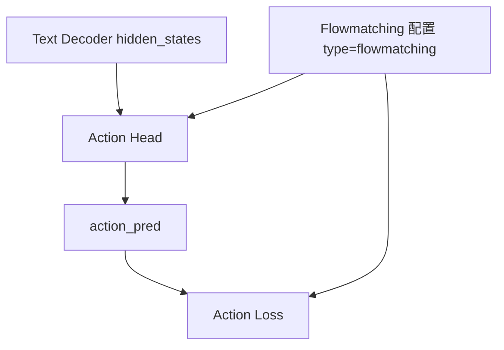
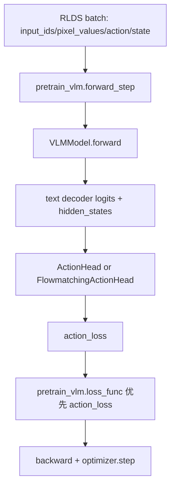
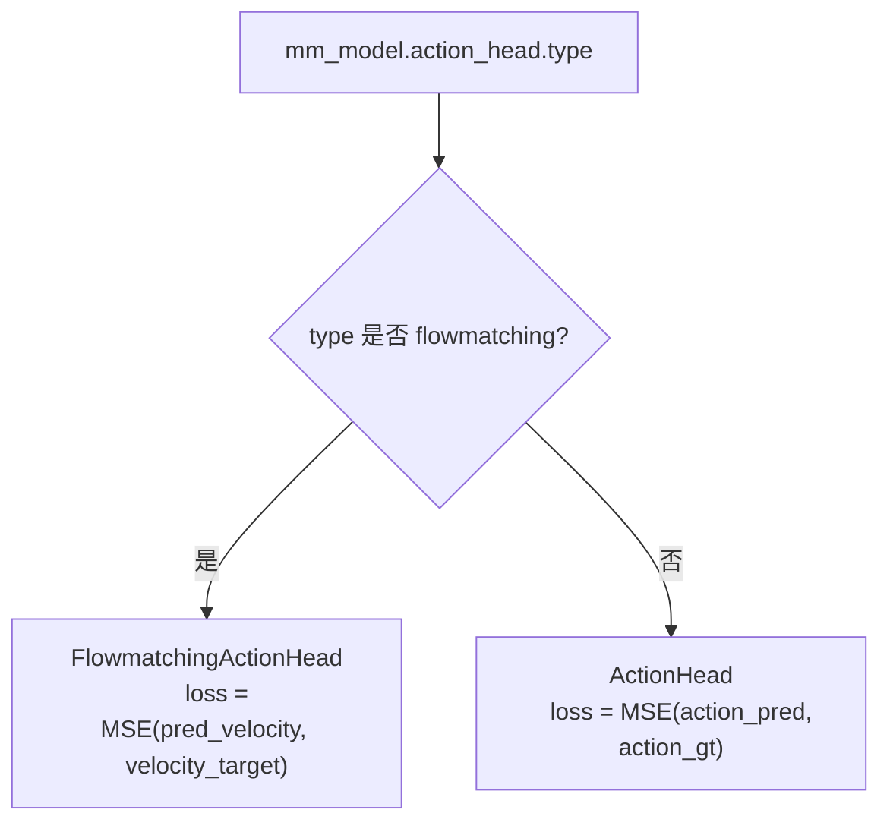

# VLA Action Head + Action Loss + Flowmatching 改造记录

本文档基于 `vla_action_head_integration_plan.md` 的风格，完整记录在 MindSpeed-MM 中将 VLA 训练链路从“仅动作预测”推进到“可稳定训练”的改造过程，重点说明三者关系：

- `Action Head`：动作预测分支结构
- `Action Loss`：训练监督目标
- `Flowmatching`：一种特定的动作建模与损失计算方式

并按“前后逻辑顺序”描述每一步怎么改、为什么改、改完后链路如何流转。

## 1. 改造目标

### 1.1 目标分层

1. **先打通结构**：模型输出 `action_pred`，不破坏原有 VLM 主干。  
2. **再接入监督**：把 `action_loss` 真正接进训练总损失。  
3. **最后补齐稳定性**：让 `train/valid/eval` 一致可用，并增加配置与数据契约校验，避免中途崩溃。

### 1.2 最终状态定义（当前）

- `dataset_type=rlds_vla` 时，训练入口优先用 `action_loss` 作为总损失。
- `action_head.type` 可选普通 MLP 或 flowmatching，分别对应不同 loss 定义。
- 评估阶段可显式计算 `action_loss`，不再局限于 `model.train()` 场景。
- 首个 batch 进行维度契约检查（`action/state` vs action head 配置）。

## 2. 三者关系说明

### 2.1 关系总览



解释：

- `Action Head` 决定“怎么从 `hidden_states` 生成动作相关输出”
- `Action Loss` 决定“如何把预测与监督信号对齐”
- `Flowmatching` 是 `Action Head` 的一种实现范式，同时定义了其专属 loss（速度场 MSE），不是简单的动作值回归

### 2.2 两类 loss 的本质区别

1. **普通 ActionHead（MLP）**
   - 直接回归动作：
   - `loss = MSE(action_pred, action_gt)`
   - 文件：`mindspeed_mm/models/action/action_head.py`

2. **FlowmatchingActionHead**
   - 先构造噪声轨迹与目标速度：
   - `noisy = (1-t)*noise + t*action`
   - `velocity_target = action - noise`
   - `loss = MSE(pred_velocity, velocity_target)`
   - 文件：`mindspeed_mm/models/action/flowmatching_action_head.py`

结论：二者都叫 `action_loss`，但监督对象不同。普通头监督“动作值”，flowmatching 监督“速度场”。

## 3. 按时间顺序的改造过程

## 3.1 阶段一：接入 Action Head（仅结构，不改训练损失）

目标：

- 在 `VLMModel.forward` 中输出 `action_pred`
- 不影响原有 LM loss 训练路径

关键改动：

- 在 `VLMModel` 中增加 action head 配置读取和构建逻辑
- text decoder 前向请求 `hidden_states`
- 后处理分支产出 `action_pred`

关键文件：

- `mindspeed_mm/models/vlm_model.py`
- `mindspeed_mm/models/common/mm_gpt_model.py`

阶段结果：

- 训练主循环仍可只消费 `loss_dict/logits`
- 为后续 action loss 接入预留完成

## 3.2 阶段二：接入 Action Loss（训练侧正式启用）

目标：

- 将 `action_loss` 作为 VLA 主训练损失（对齐 UnifoLM 训练范式）

关键改动：

1. **模型侧**：在 `VLMModel.forward` 中计算并返回 `action_loss`
2. **训练侧**：`pretrain_vlm.py::loss_func` 优先使用 `output_tensor["action_loss"]`
3. **兼容性**：若存在 `loss_dict["loss"]`，仅作为日志 `lm_loss` 记录，不作为主反传损失

关键文件：

- `mindspeed_mm/models/vlm_model.py`
- `pretrain_vlm.py`

阶段结果：

- VLA 训练从“只预测不监督”变为“可真实更新动作分支参数”

## 3.3 阶段三：补齐稳定性（评估 + 配置校验 + 冒烟测试）

目标：

- 防止“训练能跑、评估报错”
- 防止“配置合法但语义不匹配”
- 防止“训练数小时后才发现维度错误”

关键改动：

1. **评估阶段 action_loss 打通**
   - 在 `VLMModel.forward` 中增加 `compute_action_loss` 控制
   - 非训练态也可计算 action loss
2. **VLA 配置强校验**
   - `dataset_type=rlds_vla` 时要求：
     - `action_head.enable=true`
     - `action_dim/action_horizon` 合法
     - `collate_param.model_name` 属于 `vla_seq/qwen2vl_vla`
     - `use_proprio=true` 时 `state_dim>0`
3. **首批 batch 契约校验**
   - 校验 `action` 的 `[B,T,D]` 与 action head 配置一致
   - 校验 `state` 与 `state_dim` 一致
4. **最小冒烟测试**
   - 新增 `tests/ut/models/test_vla_action_head_smoke.py`
   - 覆盖 `compute_loss` 正常与 shape guard 场景

关键文件：

- `mindspeed_mm/models/vlm_model.py`
- `pretrain_vlm.py`
- `tests/ut/models/test_vla_action_head_smoke.py`

阶段结果：

- VLA 训练链路达到“可正式稳定训练”的工程状态

## 4. 端到端数据与损失调用链

### 4.1 训练主链路



### 4.2 Action Head 类型分流



## 5. 关键实现对照

### 5.1 Action Head 构建分流

文件：`mindspeed_mm/models/vlm_model.py`

```python
def _build_action_head(self, text_hidden_size: int):
    action_head_type = str(getattr(self.action_head_config, "type", "mlp")).lower()
    if action_head_type in {"flowmatching", "flow_matching", "flowmatching_dit", "dit", "dit_l"}:
        return FlowmatchingActionHead(self.action_head_config, text_hidden_size=text_hidden_size)
    return ActionHead(self.action_head_config, text_hidden_size=text_hidden_size)
```

### 5.2 评估阶段 loss 可计算开关

文件：`mindspeed_mm/models/vlm_model.py`

```python
compute_action_loss = self.training or bool(kwargs.get("compute_action_loss", False))
if hasattr(self.action_head, "compute_loss") and action_target is not None and compute_action_loss:
    action_loss = self.action_head.compute_loss(...)
```

### 5.3 训练侧总损失优先 action_loss

文件：`pretrain_vlm.py`

```python
action_loss = output_tensor.get("action_loss", None)
if action_loss is not None:
    # 作为主损失回传
    return action_loss, loss_dir
```

## 6. 配置建议（正式训练）

建议在 `mm-model.json` 顶层配置：

```json
{
  "action_head": {
    "enable": true,
    "type": "flowmatching",
    "action_dim": 7,
    "action_horizon": 8,
    "state_dim": 8,
    "hidden_layout": "sbh",
    "repeated_diffusion_steps": 1
  }
}
```

同时保证数据侧：

- `dataset_param.dataset_type = "rlds_vla"`
- `dataloader_param.collate_param.model_name = "vla_seq"`（推荐）
- `action/state` 维度与 action head 配置一致

## 7. 常见问题与排查

### 7.1 为什么 eval 阶段以前会拿不到 action_loss

原因：`action_loss` 之前只在 `self.training=True` 分支计算。  
现在通过 `compute_action_loss=True` 显式允许 eval 计算。

### 7.2 为什么要做首批 batch 契约校验

因为 VLA 维度错误（`action_horizon/action_dim/state_dim`）往往在长时间训练后才暴露，提前 fail-fast 更安全。

### 7.3 Flowmatching 和普通 ActionHead 如何选

- 追求与 UnifoLM VLA 训练范式一致：优先 `flowmatching`
- 需要简单稳定 baseline：可先用普通 `ActionHead + MSE(action_pred, action_gt)`

## 8. 当前能力边界与后续建议

当前已经完成：

- Action Head 结构接入
- Action Loss 训练主路径接入
- Flowmatching loss 与普通 MSE loss 共存
- 评估损失、配置校验、batch 契约校验、最小烟测

建议下一步：

1. 增加联合损失配置化（`total_loss = w_action * action_loss + w_lm * lm_loss`）
2. 增加动作质量指标（按 horizon 分段的 MSE/L1）
3. 增加单机多卡的 VLA 端到端 ST 用例（1~2 step）
