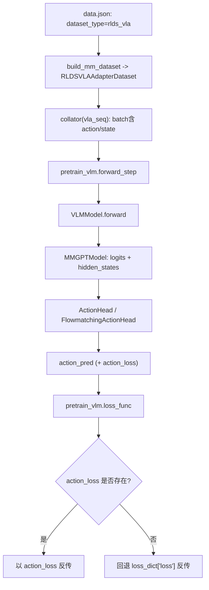

# VLA Action 迁移适配总览

本文档说明：

- 改造目标
- 代码修改点
- 训练时实际调用链

---

## 1. 改造目标

VLA 迁移适配分三层目标：

1. 打通动作分支结构：在不破坏原有 VLM 主干的前提下，模型可输出 `action_pred`。
2. 接入动作监督：将 `action_loss` 纳入训练主路径，使 VLA 训练真正更新动作分支。
3. 统一 flowmatching 方案：支持 `action_head.type=flowmatching`，并与普通 MLP action head 共存。

当前代码状态：
- `dataset_type=rlds_vla` 时，训练入口优先使用 `action_loss` 作为反传损失。
- 动作头支持两类实现：
  - `ActionHead`（直接动作回归）
  - `FlowmatchingActionHead`（速度场回归）
- 模型输出结构统一包含 `action_pred`，并按条件返回 `action_loss`。

---

## 2. 关键代码改动清单（按模块）

### 2.1 `mindspeed_mm/models/action/action_head.py`

新增/完善普通动作头：
- 输入：`hidden_states`（可选 `state`）
- 输出：`action_pred`，形状 `[B, action_horizon, action_dim]`
- 增加 `compute_loss(...)`：`MSE(action_pred, action_gt)`

这提供了最小可用的动作回归基线。

### 2.2 `mindspeed_mm/models/action/flowmatching_action_head.py`

新增 flowmatching 动作头：
- 训练：`compute_loss(...)` 计算速度场 MSE
  - `noisy = (1-t)*noise + t*action`
  - `velocity_target = action - noise`
  - `loss = MSE(pred_velocity, velocity_target)`
- 推理：`predict_action(...)` 迭代更新动作
- 前向：`forward(...)` 默认走 `predict_action(...)`

并支持关键配置：
- `diffusion_model_cfg`（层数、头数、head_dim、cross_attention_dim、interleave_self_attention）
- `num_target_vision_tokens`
- `repeated_diffusion_steps`
- `use_vl_proj`

### 2.3 `mindspeed_mm/models/vlm_model.py`

这是动作分支接线的核心位置：

1. 读取 `action_head` 配置，计算 `enable_action_head`。  
2. 在 `_build_action_head(...)` 中按 `type` 分派：
   - `flowmatching/flow_matching/flowmatching_dit/dit/dit_l` -> `FlowmatchingActionHead`
   - 其他 -> `ActionHead`
3. `text_decoder` 前向开启 `output_hidden_states=self.enable_action_head`，复用同一次 decoder 计算。
4. 后处理阶段根据条件计算：
   - `action_loss`（训练态，或显式 `compute_action_loss=True`）
   - `action_pred`（评估态默认返回；训练态仅显式 `return_action_pred=True` 时返回）
5. 输出字典统一增加：
   - `action_pred`
   - `action_loss`

### 2.4 `pretrain_vlm.py`

训练入口完成 VLA 主路径接入：

1. `forward_step(...)`  
   - 当 `dataset_type=rlds_vla` 时，自动注入 `batch["compute_action_loss"]=True`。  
   - 在首个 batch 执行 `action/state` 与 action head 配置契约校验。  

2. `loss_func(...)`  
   - 若 `output_tensor["action_loss"]` 存在：优先作为主损失反传。  
   - 若同时存在 LM loss：仅作为日志项（`lm_loss`）记录。  
   - 若无 `action_loss`：回退到原 `loss_dict["loss"]` 路径。  

---

## 3. 数据到损失的调用链

---

## 4. 配置与行为对照

### 4.1 关键配置（`mm-model.json`）

- `action_head.enable=true`
- `action_head.type`
  - `flowmatching` 系列：启用 FlowmatchingActionHead
  - 其他：启用普通 ActionHead
- `action_head.action_dim`
- `action_head.action_horizon`（或 `num_queries` 回退）
- `action_head.state_dim`
- `action_head.hidden_layout`（通常 `sbh`）

### 4.2 训练行为

- `rlds_vla` 训练默认会计算动作损失（`compute_action_loss=True` 由入口注入）。
- `action_loss` 存在时，训练主损失优先使用 `action_loss`。
- `action_pred` 在训练态默认不强制返回；评估态默认返回（或训练态显式请求返回）。

---

## 5. 迁移后的代码责任边界

为了后续维护清晰，当前边界如下：

- 模型结构与输出契约：`VLMModel` 负责
  - 负责 action head 构建、前向分流、`action_pred/action_loss` 输出
- 动作损失定义：`ActionHead/FlowmatchingActionHead` 负责
  - 负责各自 `compute_loss` 语义
- 训练损失选择：`pretrain_vlm.py` 负责
  - 负责 `action_loss` 与 `loss_dict` 的优先级策略
- 数据字段契约：`rlds_vla + vla_seq collator` 负责
  - 负责向模型提供 `action/state` 标准字段

这保证了后续问题可在单一责任模块内修改，不需要跨文件大范围联动。
